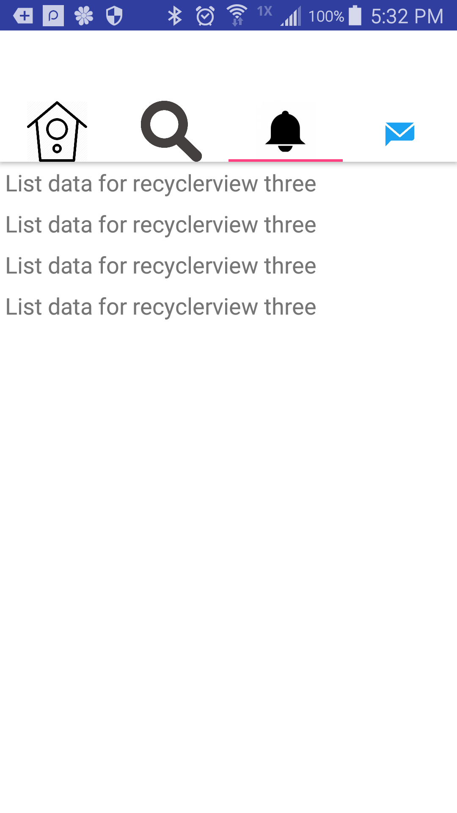

# Android-TwitterLayout
Example of Twitter's scrolling layout with toolbar hiding on scroll

I do NOT own the icons used for the Tab bars. They were just used as examples to showcase a similar design as Twitter

 
 

